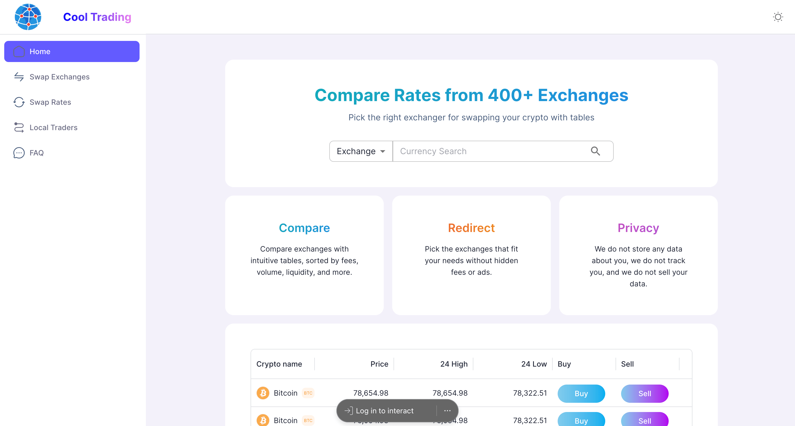

# Cool Trading

This is a [Next.js](https://nextjs.org/) application.



## Table of Contents

- [Getting Started](#getting-started)
- [Prerequisites](#prerequisites)
- [Installation](#installation)
- [Running the Project](#running-the-project)
- [Building for Production](#building-for-production)
- [Learn More](#learn-more)
- [License](#license)

## Getting Started

To get a local copy up and running, follow these steps.

## Prerequisites

Ensure you have the following installed on your local machine:

- **Node.js** (v18.20.4 or later recommended)


You can download Node.js from [here](https://nodejs.org/en/download/).

## Installation

1. Clone the repository:

    ```bash
    git clone https://github.com/unaisshemim/cooltrading.git
    ```

2. Navigate to the project directory:

    ```bash
    cd cooltrading
    ```

3. Install the dependencies:

    ```bash
    npm install

    ```

## Running the Project

4.To run the project locally, use the following command:

   
    
    npm run dev

    
 
 

Open [http://localhost:3000](http://localhost:3000) with your browser to see the result.

## Building for Production

To create an optimized production build, run:

    
    npm run build
   


## Learn More

To learn more about Next.js, take a look at the following resources:

- [Next.js Documentation](https://nextjs.org/docs) - learn about Next.js features and API.
- [Learn Next.js](https://nextjs.org/learn) - an interactive Next.js tutorial.

## License

Distributed under the MIT License. See `LICENSE` for more information.

